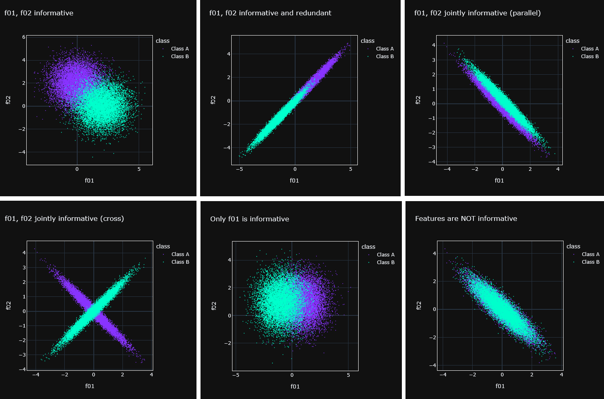
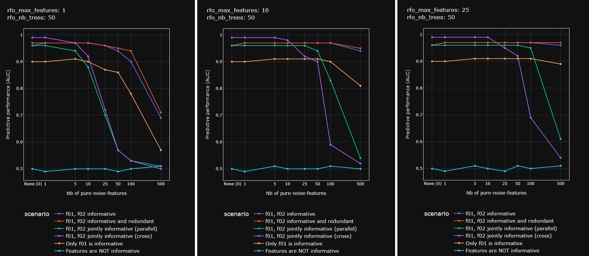

# Impact of pure-noise-features on predictive performance in supervised classification
* This is a **didactic mini-project**
* In supervised classification applications, many features are available but we suspect that not all needed.
* Finding every last non-informative feature if often not feasible.
* It is legitimate to ask which amount of un-informative feature is acceptable

## Summary
* A binary class variable and two features that inform classification are created
* Many more pure-noise-features can be added the the feature space
* Random Forest Classifiers are trained on this data and their predictive performance (AUC) is computed on a test set
* Plots are made to illustrate how pure-noise-features impacts the predictive performance

## Why Random Forest (RF)
*  RF was chosen because it can handle non-linear problems, is robust to feature scale, its hyper-parameters ar easy to tune
*  RF has one very important hyper-parameter: **max_features**, "The number of features to consider when looking for the best split"
*  Setting **max_features** = 1 mean at each split the feature to use is chosen at random

## Why Synthetic data 
*  Strength : we have full ground truth, easy to interpret
*  Weakness : not realistic

## A word of caution
* The scenarios assessed here are artificial and by no way representative of  situations encountered in the real world
* Yet, they are great way to didactically illustrate the subtle interactions between data and models 

## Some scenarios
*  Only the two first features are show, 
*  Allo other features are sampled from exactly the same random normal for both classes




## Result from the 6 scenarios above
*  Predictive performance is measured with the AUC from test set
*  Inclusion of more pure-noise-features did negatively impact performance in most scenarios
*  A small amount of pure-noise-features often had no measurable impact on performance
*  The scenarios with joint information if f01 and f02 seem more vulnerable to pure-noise-features
*  Increasing **max_features** parameter of RF made the models more robust to pure-noise-features




## Usage / Sample code
```python 

import os


```


## Dependencies / Intallation
* Developed under Python 3.12.8
* First make a venv, then:
```
pip install -r requirements.txt
```


